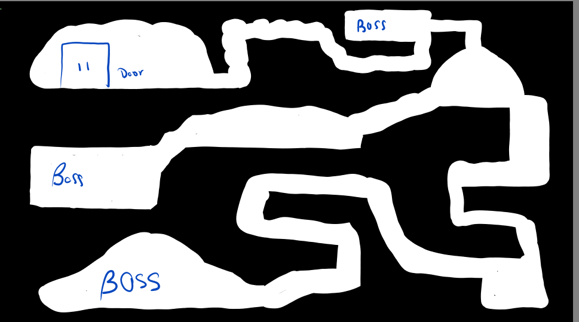
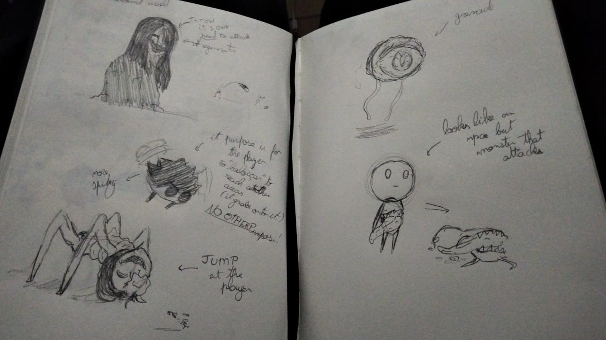
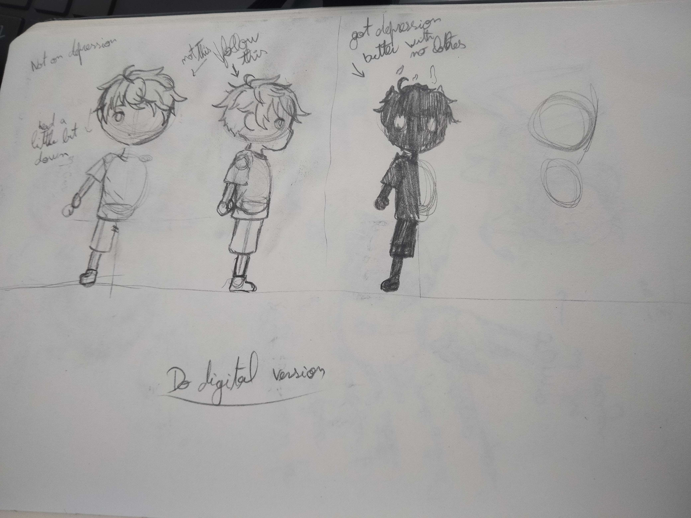
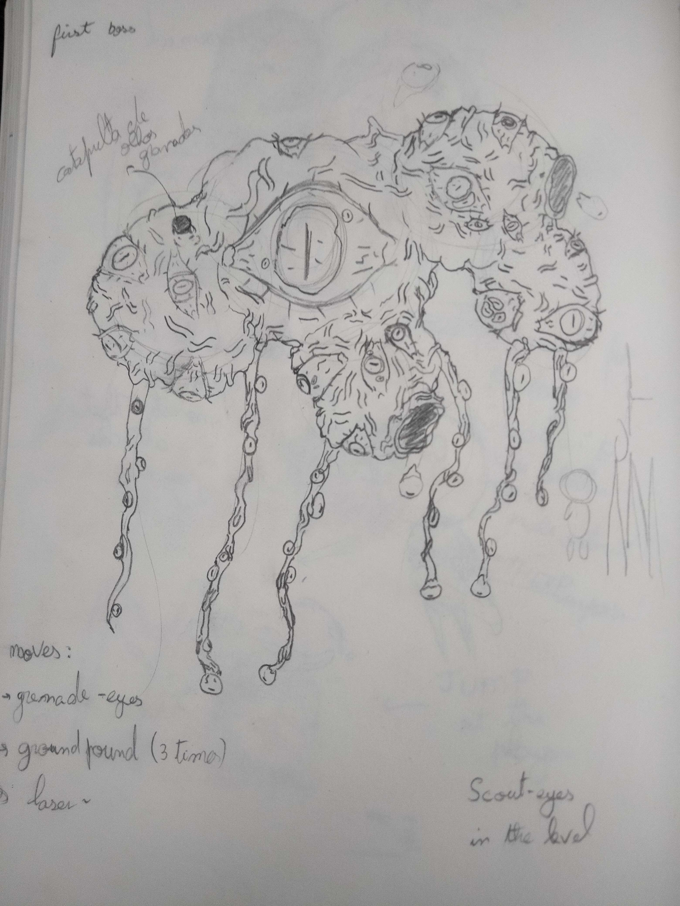
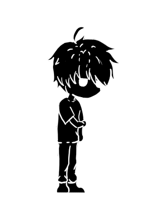
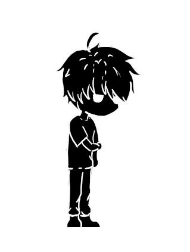
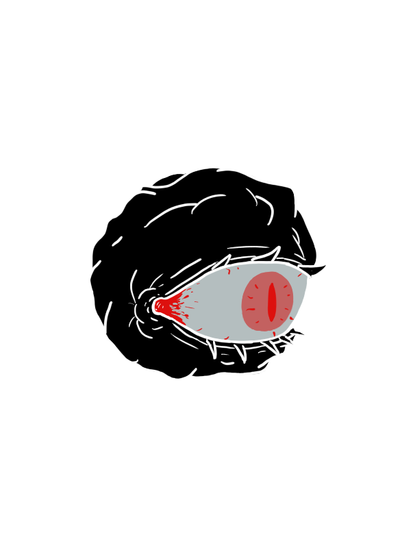

# Unworthy-Android

A dark metroidvania game built in Kotlin for Android.

## Grupo

- Bruno Moreira (29561)
- Margarida Sousa (27929)
- Vítor Guerra (27950)

## Introdução

### Descrição do Jogo

*Unworthy* é um jogo no estilo metroidvania. Presentemente, é apenas uma demonstração de um conceito
de um jogo bem mais complexo, que futuramente gostaríamos de desenvolver.
Através desta *demo*, apresentamos as mecânicas e o universo que pretendemos expandir no futuro.

O jogo foi criado de raiz pelo nosso grupo, todo o enredo, *worldbuilding*, e designs foram
concebidos por nós com o intuito de criar um jogo cativante ao olho e visualmente único.

O estilo visual do jogo é conseguido através de arte completamente desenhada à mão em software de
desenho digital, com todas as animações feitas a 12 frames por segundo.

* **Enredo**: No jogo, o protagonista deve enfrentar o estranho mundo dos seus pesadelos, que
  refletem alguns dos seus maiores traumas. Esses pesadelos não são apenas desafios a serem
  superados, mas também servem como um meio para explorar a profundidade emocional e psicológica do
  personagem principal.

* **Ambiente**: Os mapas do jogo foram criados utilizando o software
  [Tiled](https://www.mapeditor.org/), garantindo uma experiência visual única e imersiva.
  A atmosfera mais sombria é usada para refletir os temas de medo e a superação inseridas no enredo
  do jogo.

* **Jogabilidade**: A jogabilidade de *Unworthy* combina elementos clássicos do género metroidvania,
  com exploração do mundo e combates desafiadores. Os jogadores precisam usar estratégia e precisão
  para derrotar os seus medos e avançar no jogo.

<br/>

### Arte Conceptual

<p>
<picture></picture>
<picture></picture>
<picture></picture>
<picture></picture>
</p>

<br clear="left"/>


### Player

* **Lie**: o jogador encara este mundo como o Lie, uma criança depressiva que cai misteriosamente
  num mundo
  desconhecido, transformado numa criatura revestida por algo misterioso. Lie, inevitavelmente
  explora este mundo
  procurando uma saída e vê-se forçado a enfrentar os seus maiores medos com todos os meios
  possíveis.

<p align="center">
<picture></picture>
<picture></picture>
</p>

### Inimigos

* **Fly-e**: Uma criatura misteriosa formada por um olho onde a sua existência serve para garantir
  que nada passa por ele, o que poderá causar problemas ao jogador.

<p align="center">
<picture></picture>
<picture></picture>
</p>

<br/>

## Implementação e Estrutura do Projeto

No desenvolvimento do projeto foi necessário implementar várias classes para permitir o
funcionamento do jogo.

A classe `UnworthyApp` é uma subclasse de `KtxGame`, e é a classe principal do jogo, onde arranca
o ciclo de vida do jogo.
Esta class gere "Screens", que tipicamente representam diferentes níveis de um jogo, 
mas no nosso caso implementámos uma classe chamada `Scene`, subclasse de `KtxScreen`, à qual
acrescentamos outras funcionalidades, como a capacidade de detetar o input do jogador implementando
a interface `KtxInputAdapter`.

`Scene` é também subclasse de `GameObjectList`, outra classe que implementámos para gerir
os vários game objects de uma cena, delegando-lhes eventos do ciclo de vida do jogo, como o `update`
e o `draw`.

`GameObjectList` consiste num game object composto por vários outros game objects, e é responsável
por delegar eventos do ciclo de vida do jogo aos seus game objects filhos.

`GameObject` é uma class base de todos os game objects do jogo.

Como podemos ver, com esta estrutura, temos um sistema em que praticamente tudo é um Game Object,
desde o jogador, aos inimigos, ao terreno, e até mesmo os botões que o jogador usa para interagir 
e as cenas (Scenes) em si.

Esta estrutura permite-nos facilmente criar novos game objects, e gerir o ciclo de vida
do jogo de forma organizada.

Organizámos os vários ficheros do projeto da seguinte forma:

* **core**: Contém classes que gerem as cenas, animações, game objects, etc.
* **input**: Contém game objects capazes de detetar o input do jogador, como botões e "analógico"
  on-screen.
* **models**: Contém modelos de dados, como o `PlayerData`.
* **objects**: Contém os vários game objects do jogo, como terreno, texto, inimigos, o jogador, etc.
* **scenes**: Contém as diferentes cenas (níveis / estados) do jogo.
* **utils**: Contém utilidades e extensões para várias classes que auxiliam diversas operações.

<br/>

## Modelo de Dados

Trando-se de um jogo relativamente simples, o modelo de dados que implementamos é também bastante
simples.

Temos apenas uma data class `PlayerData` que descreve algumas informações sobre o jogador, como o
tempo de jogo, a quantidade de inimigos derrotados, e a quantidade de vezes que o jogador morreu.

Assim, usamos esta class para armazenar a informação do jogador, a qual é armazenada na base de
dados **Firebase Firestore** para que possa ser posteriormente consultada.
```kotlin
data class PlayerData(
    var totalPlaytime: Long = 0,
    var enemiesDefeated: Int = 0,
    var deaths: Int = 0
)
```

<br/>

## Tecnologias utilizadas

### Ferramentas de Desenvolvimento

* [libGDX](https://libGDX.com): Framework de desenvolvimento de jogos multiplataforma.
* [KTX](https://libktx.github.io/): Extensão para o **libGDX** que facilita o workflow do mesmo em
  Kotlin.
* [Firebase](https://firebase.google.com): Toolset de desenvolvimento de aplicações móveis e web.

### Software

* [SpriteFactory](https://github.com/craftworkgames/SpriteFactory): Ferramenta que auxilia na
  criação de spritesheets para animações.
* [Tiled](https://www.mapeditor.org/): Editor de mapas.
* [Krita](https://krita.org): Software de desenho digital.
* [Photoshop](https://www.adobe.com/products/photoshop.html): Software de edição de imagem.
* [Aseprite](https://www.aseprite.org): Software de criação de sprites e animações.

<br/>

## Dificuldades encontradas

Ao longo do desenvolvimento do projeto, deparamo-nos com algumas dificuldades, mas a que mais
se destacou foram os vários sistemas de coordenadas utilizados pelo **libGDX**.

Dependendo do contexto, o **libGDX** usa diferentes sistemas de coordenadas, o que foi inesperado e
confuso.

Por exemplo, em relação ao toque no ecrã, quando pretendemos detetar onde o jogador tocou,
o sistema de coordenadas é **y-down**, isto é, o ponto de origem (0, 0) é o canto superior esquerdo
do ecrã.

Por outro lado, o sistema de coordenadas no que toca ao desenho de texturas no ecrã,
é um sistema **y-up**, onde o ponto de origem (0, 0) é o canto inferior esquerdo do ecrã.

Esta diferença de sistemas de coordenadas causou-nos alguma confusão e bugs inesperados, o que
atrasou o desenvolvimento do projeto.

<br/>

## Conclusão

Apesar de presentemente se tratar de um protótipo, este jogo é um projeto que nos orgulhamos
bastante.

Através dele, conseguimos desenvolver várias competências, e permitiu-nos explorar o
desenvolvimento de jogos para plataformas móveis, bem como o uso de ferramentas como o **libGDX** e
o **Firebase**.

Esperamos continuar o desenvolvimento deste jogo para que possamos futuramente publicá-lo.

<br/>

## Créditos

* Música de fundo do jogo por: [Crow Shade](https://soundcloud.com/crowshade).
